# Architecture

This document describes the high-level architecture of the ForgeKit Core
starter kit: how the addon, the MCP server, and the consolidated
`forgekit_rpg` paid module fit together, and how AI agents reach into each
part through the three MCP channels.

## Context diagram

```mermaid
graph LR
    AI[AI_Agent<br/>LLM client]
    MCP[MCP Server<br/>&#64;forgekit/core-mcp<br/>Node.js]
    Editor[Editor Plugin<br/>WebSocket 6010-6019]
    CLI[CLI Runner<br/>spawn godot --headless]
    Runtime[Runtime Bridge<br/>UDP 6020-6029]
    Core[ForgeKit Core<br/>addons/forgekit_core/<br/>GameEvents + McpBridge]
    RPG[ForgeKit RPG Module<br/>addons/forgekit_rpg/<br/>combat / crafting /<br/>inventory / stats]
    GUT[GUT framework<br/>addons/gut/]

    AI <-->|stdio JSON-RPC 2.0| MCP
    MCP <-->|WebSocket JSON-RPC 2.0| Editor
    MCP -->|spawn| CLI
    MCP <-->|UDP JSON-RPC| Runtime

    Editor --> Core
    Runtime --> Core
    CLI --> GUT
    Core --> RPG
```



### Responsibilities

- **AI agent** — any MCP-aware LLM client (Claude Desktop, Claude Code,
  Cursor, Cline, Copilot, Antigravity, Windsurf, Kiro). Talks to the MCP
  server over stdio JSON-RPC 2.0.
- **MCP server (`@forgekit/core-mcp`)** — the only process the agent
  connects to. It multiplexes requests across the three channels below and
  enforces profile-level tool filtering, auth, and rate limits.
- **ForgeKit Core addon** — the MIT-licensed Godot 4.x addon that ships
  `GameEvents` (the event bus), the base `Resource` types, the module
  manifest loader, and the editor/runtime/licensing bridges. It is the
  fixed surface that every MCP tool talks to on the Godot side.
- **ForgeKit RPG Module addon** — the paid commercial addon installed
  under `addons/forgekit_rpg/`. Consolidates Combat, Crafting, Inventory,
  and Stats as four subsystems behind a single manifest, a single
  `public_api.gd`, and a single `license_id`. Optional; Core runs
  without it.

## Three MCP channels

Each channel is tuned to a different agent workflow. The MCP server picks
the right channel per tool.

### 1. Editor Plugin — WebSocket JSON-RPC 2.0

- **Transport:** WebSocket on `127.0.0.1`. First free port in the range
  `6010-6019` is selected at startup. The active port is written to
  `user://mcp_active_port.json` so the server can discover it.
- **Protocol:** JSON-RPC 2.0 (standard request/response, ids, batching).
- **Runs inside:** the Godot editor, as a tool script under
  `addons/forgekit_core/mcp/editor_plugin/`.
- **Bind-time warnings.** On a successful start with the default
  loopback `bind_address = "127.0.0.1"`, the server emits no warnings —
  `get_warnings()` returns an empty array. Configuring a non-loopback
  `bind_address` (for example `0.0.0.0`) still starts the server but
  appends an `EXTERNAL_BIND_ENABLED` warning to `get_warnings()` so the
  operator knows editor-plugin traffic is now reachable beyond the
  local host.
- **Mutation safety:** every tool that changes scene or resource state
  goes through `Undo_Redo_Wrapper`, so `Ctrl+Z` in the editor always
  reverts an agent edit. Writes to `project.godot` and `.tres` files go
  through `ProjectSettingsAtomicWriter` (read &rarr; parse &rarr; modify
  &rarr; write-temp &rarr; fsync &rarr; rename) so concurrent readers
  never observe a half-written file.
- **Typical tools:** `scene.open`, `scene.save`, `node.add`,
  `node.set_property`, `resource.load`, `resource.save`,
  `resource.inspect`, `transaction.begin` / `commit` / `rollback`,
  `gdscript.save_with_validation`, `project.list_modules`.

### 2. CLI headless — spawn `godot --headless`

- **Transport:** the MCP server spawns the Godot binary with
  `--headless --script <path>` and reads back a JSON `TestReport` on
  stdout.
- **Protocol:** structured JSON payloads, not JSON-RPC. Inputs are
  command-line flags and a script entry point; outputs are a single
  `TestReport` object per invocation.
- **Runs inside:** a short-lived Godot process with no graphical editor.
- **Typical tools:** `tests.run_unit`, `tests.run_suite`,
  `tests.run_gameplay`, `tests.run_property`, `gdscript.validate`,
  `project.check_imports`.
- **Why it exists:** CI, pre-commit validation, and property tests must
  run without an open editor session, and they must report results in a
  shape the self-healing loop can parse.

### 3. Runtime Bridge — UDP JSON-RPC

- **Transport:** UDP on `127.0.0.1`. First free port in the range
  `6020-6029` is selected at startup, and the active port is written to
  `user://mcp_active_port.json` under the `runtime` key. Active only
  when the game is launched with the `--mcp-bridge` flag.
- **Bind-time warnings.** On a successful start with the default
  loopback `bind_address = "127.0.0.1"`, the server emits no warnings —
  `get_warnings()` returns an empty array. Configuring a non-loopback
  `bind_address` (for example `0.0.0.0`) still starts the server but
  appends an `EXTERNAL_BIND_ENABLED` warning to `get_warnings()` so the
  operator knows runtime-bridge traffic is now reachable beyond the
  local host.
- **Active-port file atomicity:** the runtime bridge writes its entry
  through a sibling `.tmp` file plus a rename, so a concurrent reader
  observes either the complete previous contents or the complete new
  contents of `user://mcp_active_port.json`, never a truncated file. If
  the rename fails the existing file is left byte-for-byte intact and
  the `.tmp` sidecar is cleaned up, so entries written by other
  channels (editor, visualizer, health) survive a failed runtime-bridge
  write.
- **Protocol:** JSON-RPC 2.0 framed into individual UDP datagrams. The
  server rejects packets larger than 65 507 bytes with
  `PACKET_TOO_LARGE`.
- **Runs inside:** the running game, via the `McpBridge` autoload
  registered by ForgeKit Core.
- **Mutation safety:** runtime tools do not touch on-disk state, so the
  Undo stack does not apply. `runtime.eval_safe` only evaluates the
  closed grammar implemented by `Smart_Type_Parser`; it never calls
  `eval`.
- **Typical tools:** `inventory.add_item`, `inventory.get_count`,
  `crafting.execute`, `input.simulate_action`,
  `scene.get_tree_snapshot`, `runtime.get_scene_tree`,
  `runtime.get_current_scene`, `runtime.change_scene`,
  `runtime.reload_current_scene`, `runtime.handshake`,
  `runtime.heartbeat`.

## Browser Visualizer — optional HTTP preview

A read-only HTTP server on `127.0.0.1` that renders the current edited
scene as a force-directed graph. It runs inside the editor alongside
the WebSocket JSON-RPC channel on the first free port in `6030-6039`
and writes the active port to `user://mcp_active_port.json` under the
`visualizer` key (atomic temp-file + rename, same rules as the other
channels).

### Pages

- `GET /` (and `/index.html`) — three-tab browser viewer that switches
  between the scene tree, the module dependency graph, and the event
  bus subscriber graph via a shared force-directed layout engine.

### JSON endpoints

The static page fetches its data from three JSON endpoints:

- `GET /api/scene_tree` — `{nodes, edges}` for the edited scene. Nodes
  are `{id, label, type}`. Responses beyond 1 000 nodes include
  `truncated: true`.
- `GET /api/module_graph` — `{nodes, edges}` for the installed
  ForgeKit modules. Nodes are `{id, version, depends_on}`; edges
  point from a dependent module to the module it depends on.
- `GET /api/event_bus` — `{signals}` listing every declared signal on
  the `GameEvents` autoload with its payload types and current
  subscribers. Subscribers are `{object_id, object_class?, method}`.

### Notes

- The server is `GET`-only. Any other HTTP method returns
  `405 Method Not Allowed`. Unknown paths return `404 Not Found`.
- Binding to a non-loopback `bind_address` (for example `0.0.0.0`)
  still starts the server but surfaces an `EXTERNAL_BIND_ENABLED`
  warning so the operator knows visualizer traffic is reachable beyond
  the local host.
- The scene-tree provider is injected by the editor plugin at startup.
  When a provider is not wired up, `/api/scene_tree` returns an empty
  document (`{nodes: [], edges: []}`) rather than erroring. If the
  bundled `index.html` is missing, `GET /` still returns `200 OK` with
  a minimal placeholder page and a `VISUALIZER_INDEX_MISSING` warning
  is logged.

## Module consolidation — why `forgekit_rpg` is one module

The paid layer ships as a single module (`addons/forgekit_rpg/`) that
bundles four subsystems instead of shipping four separate modules. This
keeps the publishing and licensing story simple:

- **One manifest** — `module.manifest.tres` declares `id = "forgekit_rpg"`,
  one `version`, and one `core_min_version`. `modules.check_compatibility`
  only has one row to reason about for the RPG layer.
- **One license** — `modules.activate_license("forgekit_rpg", <license_id>, <signature>)`
  verifies a single HMAC-SHA256 license file at
  `user://licenses/forgekit_rpg.key` and unlocks the full set of RPG
  subsystem tool categories at once — today `combat`, `crafting`,
  `inventory`, `stats`, `effects`, `magic`, `equipment`,
  `progression`, `enemies`, `loot`, `spawner`, `chests`, `npc`,
  `dialog`, and `vendor` (see
  `mcp-server/src/licensing/startup.ts`).
- **One CI pipeline** — the private `ForgeKitStudio/forgekit-rpg`
  repository runs a single `ci.yml` covering the whole module, plus an
  `integration-with-core` job that pins against the Core tag listed in
  `manifest.core_min_version`.
- **One release channel** — `release-module.yml` packages the directory,
  signs the manifest, and publishes a single ZIP to itch.io and Gumroad
  per tag.

Internally the module still has four subsystems for separation of
concerns:

```text
addons/forgekit_rpg/
├── module.manifest.tres
├── public_api.gd              # Cross-subsystem contract
├── combat/                    # Hitbox / Hurtbox / StateMachine
├── crafting/                  # Crafting_Manager, Recipe_Generator, recipes/*.tres
├── inventory/                 # Inventory_System, items/*.tres
└── stats/                     # Stats_System, modifiers
```

### Boundary rules

Two import rules are statically enforced by `project.check_imports` and
by the `tools/cli_runner/check_imports.sh` helper:

1. **Core may not import from any `forgekit_<module>/` tree.** ForgeKit
   Core ignores whether the RPG addon is installed.
2. **RPG subsystems may only reach each other through `public_api.gd`.**
   A file under `addons/forgekit_rpg/combat/` that directly `preload`s
   `res://addons/forgekit_rpg/inventory/...` is flagged as a violation.
   This keeps the four subsystems independently testable and keeps the
   public module surface narrow.

The MCP server exposes the same tool (`project.check_imports`) to agents
and to CI, so the rule cannot drift between the two contexts.

## Data flow: end-to-end crafting call

The scenario below shows how the three channels cooperate during a
typical AI-driven edit-and-play loop against the RPG module.

1. **Agent authors a recipe** through the Editor Plugin:
   `resource.save("addons/forgekit_rpg/crafting/recipes/iron_ingot.tres", ...)`.
   The Editor Plugin routes the write through `UndoRedoWrapper` and
   `ProjectSettingsAtomicWriter`.
2. **Agent validates the project** through the CLI channel:
   `project.check_imports` and `tests.run_unit` both spawn
   `godot --headless` and return a `TestReport` JSON. CI runs the exact
   same tools.
3. **Agent starts the game with `--mcp-bridge`.** `McpBridge` opens a
   UDP socket on the first free port in `6020-6029` and writes the port
   into `user://mcp_active_port.json`.
4. **Agent drives gameplay** through the Runtime Bridge:
   `inventory.add_item("iron_ore", 2)`, then
   `crafting.execute("iron_ingot")`. The runtime side emits
   `GameEvents.crafting_completed` in the same frame so subscribed
   subsystems (inventory, stats, UI) react synchronously.
5. **Agent tears down** with `runtime.shutdown` (or kills the process).
   The UDP socket closes and the editor remains ready for the next
   authoring pass.

## See also

- `docs/mcp_api.md` — MVP tool surface with JSON-RPC contracts.
- `README.md` — Quickstart, port layout, and profile overview.
- `CLAUDE.md` — client-side rules for AI agents working in a project
  built from this template.
