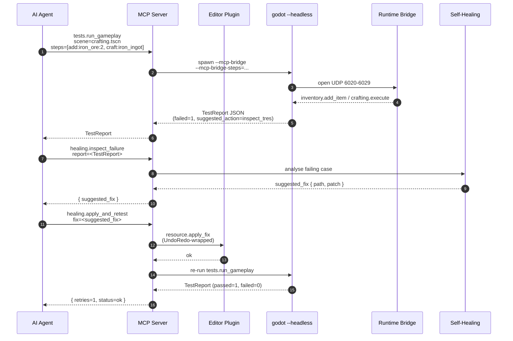

# Architecture

This document describes the high-level architecture of the ForgeKit Core
starter kit: how the addon, the MCP server, and the consolidated
`forgekit_rpg` paid module fit together, and how AI agents reach into each
part through the three MCP channels.

## Context diagram

```mermaid
graph LR
    AI[AI_Agent<br/>LLM client]
    MCP[MCP Server<br/>&#64;forgekit/core-mcp<br/>Node.js]
    Editor[Editor Plugin<br/>WebSocket 6010-6019]
    CLI[CLI Runner<br/>spawn godot --headless]
    Runtime[Runtime Bridge<br/>UDP 6020-6029]
    Core[ForgeKit Core<br/>addons/forgekit_core/<br/>GameEvents + McpBridge]
    RPG[ForgeKit RPG Module<br/>addons/forgekit_rpg/<br/>combat / crafting /<br/>inventory / stats]
    GUT[GUT framework<br/>addons/gut/]

    AI <-->|stdio JSON-RPC 2.0| MCP
    MCP <-->|WebSocket JSON-RPC 2.0| Editor
    MCP -->|spawn| CLI
    MCP <-->|UDP JSON-RPC| Runtime

    Editor --> Core
    Runtime --> Core
    CLI --> GUT
    Core --> RPG
```



### Responsibilities

- **AI agent** — any MCP-aware LLM client (Claude Desktop, Claude Code,
  Cursor, Cline, Copilot, Antigravity, Windsurf, Kiro). Talks to the MCP
  server over stdio JSON-RPC 2.0.
- **MCP server (`@forgekit/core-mcp`)** — the only process the agent
  connects to. It multiplexes requests across the three channels below and
  enforces profile-level tool filtering, auth, and rate limits.
- **ForgeKit Core addon** — the MIT-licensed Godot 4.x addon that ships
  `GameEvents` (the event bus), the base `Resource` types, the module
  manifest loader, and the editor/runtime/licensing bridges. It is the
  fixed surface that every MCP tool talks to on the Godot side.
- **ForgeKit RPG Module addon** — the paid commercial addon installed
  under `addons/forgekit_rpg/`. Consolidates Combat, Crafting, Inventory,
  and Stats as four subsystems behind a single manifest, a single
  `public_api.gd`, and a single `license_id`. Optional; Core runs
  without it.

## Three MCP channels

Each channel is tuned to a different agent workflow. The MCP server picks
the right channel per tool.

### 1. Editor Plugin — WebSocket JSON-RPC 2.0

- **Transport:** WebSocket on `127.0.0.1`. First free port in the range
  `6010-6019` is selected at startup. The active port is written to
  `user://mcp_active_port.json` so the server can discover it.
- **Protocol:** JSON-RPC 2.0 (standard request/response, ids, batching).
- **Runs inside:** the Godot editor, as a tool script under
  `addons/forgekit_core/mcp/editor_plugin/`.
- **Bind-time warnings.** On a successful start with the default
  loopback `bind_address = "127.0.0.1"`, the server emits no warnings —
  `get_warnings()` returns an empty array. Configuring a non-loopback
  `bind_address` (for example `0.0.0.0`) still starts the server but
  appends an `EXTERNAL_BIND_ENABLED` warning to `get_warnings()` so the
  operator knows editor-plugin traffic is now reachable beyond the
  local host.
- **Mutation safety:** every tool that changes scene or resource state
  goes through `Undo_Redo_Wrapper`, so `Ctrl+Z` in the editor always
  reverts an agent edit. Writes to `project.godot` and `.tres` files go
  through `ProjectSettingsAtomicWriter` (read &rarr; parse &rarr; modify
  &rarr; write-temp &rarr; fsync &rarr; rename) so concurrent readers
  never observe a half-written file.
- **Typical tools:** `scene.open`, `scene.save`, `node.add`,
  `node.set_property`, `resource.load`, `resource.save`,
  `resource.inspect`, `transaction.begin` / `commit` / `rollback`,
  `gdscript.save_with_validation`, `project.list_modules`.
- **Update notifications.** The plugin runs a periodic, rate-limited
  poll against the GitHub `releases/latest` endpoint of
  `ForgeKitStudio/forgekit-core`. When a newer Core version is
  detected, a single `UPDATE_AVAILABLE: ForgeKit Core v<new> available
  (running v<current>). Run 'npx -y @forgekit/core-mcp@latest' to
  upgrade.` line is appended to `editor.get_output_log`, so MCP
  clients that scrape the editor log stream surface the notice
  without any extra wiring. Polls are throttled to once per hour via
  a cache at `user://mcp_update_check.json`, and network failures are
  swallowed silently (no update is advertised, and the cache is only
  written on a successful fetch).
- **Tool-category adapters registered at startup.** On `_enter_tree`
  the plugin's lifecycle helper (`McpEditorPluginLifecycle`) registers
  each editor-channel tool family on the JSON-RPC dispatcher through a
  dedicated adapter factory. Twelve adapter families cover the
  authoring surface: `animation`, `tilemap`, `theme`/`ui`, `shader`,
  `physics`, `scene3d`, `particle`, `navigation`, `audio`,
  `animation_tree`, `state_machine`, and `blend_tree`. Each factory is
  injectable, so headless tests drive the lifecycle against
  in-memory fakes without opening real sockets. A lifecycle that only
  wires the WebSocket server (no dispatcher, no adapter factories)
  still starts and stops cleanly — the adapter registration is a pure
  extension.

### 2. CLI headless — spawn `godot --headless`

- **Transport:** the MCP server spawns the Godot binary with
  `--headless --script <path>` and reads back a JSON `TestReport` on
  stdout.
- **Protocol:** structured JSON payloads, not JSON-RPC. Inputs are
  command-line flags and a script entry point; outputs are a single
  `TestReport` object per invocation.
- **Runs inside:** a short-lived Godot process with no graphical editor.
- **Typical tools:** `tests.run_unit`, `tests.run_suite`,
  `tests.run_gameplay`, `tests.run_property`, `gdscript.validate`,
  `project.check_imports`, `export.list_presets`, `export.run_preset`,
  `export.validate_preset`, `android.list_devices`,
  `android.install_apk`, `android.run_logcat`.
- **Server-side-only categories.** Two CLI-channel families — `export`
  and `android` — have no Godot-side adapter. They live entirely in
  `mcp-server/src/tools/export/` and `mcp-server/src/tools/android/`,
  shelling out to `godot --headless --export-release` / `--export-debug`
  and to `adb` respectively. They read `export_presets.cfg` directly
  from disk rather than going through the editor plugin.
- **Why it exists:** CI, pre-commit validation, and property tests must
  run without an open editor session, and they must report results in a
  shape the self-healing loop can parse.

### 3. Runtime Bridge — UDP JSON-RPC

- **Transport:** UDP on `127.0.0.1`. First free port in the range
  `6020-6029` is selected at startup, and the active port is written to
  `user://mcp_active_port.json` under the `runtime` key. Active only
  when the game is launched with the `--mcp-bridge` flag.
- **Bind-time warnings.** On a successful start with the default
  loopback `bind_address = "127.0.0.1"`, the server emits no warnings —
  `get_warnings()` returns an empty array. Configuring a non-loopback
  `bind_address` (for example `0.0.0.0`) still starts the server but
  appends an `EXTERNAL_BIND_ENABLED` warning to `get_warnings()` so the
  operator knows runtime-bridge traffic is now reachable beyond the
  local host.
- **Active-port file atomicity:** the runtime bridge writes its entry
  through a sibling `.tmp` file plus a rename, so a concurrent reader
  observes either the complete previous contents or the complete new
  contents of `user://mcp_active_port.json`, never a truncated file. If
  the rename fails the existing file is left byte-for-byte intact and
  the `.tmp` sidecar is cleaned up, so entries written by other
  channels (editor, visualizer, health) survive a failed runtime-bridge
  write.
- **Protocol:** JSON-RPC 2.0 framed into individual UDP datagrams. The
  server rejects packets larger than 65 507 bytes with
  `PACKET_TOO_LARGE`.
- **Runs inside:** the running game, via the `McpBridge` autoload
  registered by ForgeKit Core.
- **Trace context per datagram.** The `McpBridge` autoload exposes two
  GDScript methods that anchor the runtime side of the shared
  `trace_id` pipeline. `observe_packet(request)` is invoked once per
  accepted UDP datagram with the parsed JSON-RPC envelope: when the
  envelope carries a `trace` field of the form
  `{ "trace_id": "<8 lowercase hex>", "span_id": "<4 lowercase hex>" }`
  the bridge echoes that pair; otherwise it mints a fresh pair in the
  same shape so every packet stays correlatable even when the sender
  omits a trace envelope. `get_last_trace_context()` returns the pair
  attached to the most recent observation as a duplicated dictionary
  (`{}` before the first call), so downstream log and telemetry code
  can tag engine-side log lines with the same `trace_id` that appears
  on the server and editor channels.
- **Mutation safety:** runtime tools do not touch on-disk state, so the
  Undo stack does not apply. `runtime.eval_safe` only evaluates the
  closed grammar implemented by `Smart_Type_Parser`; it never calls
  `eval`.
- **Typical tools:** `inventory.add_item`, `inventory.get_count`,
  `crafting.execute`, `input.simulate_action`,
  `scene.get_tree_snapshot`, `runtime.get_scene_tree`,
  `runtime.get_current_scene`, `runtime.change_scene`,
  `runtime.reload_current_scene`, `runtime.handshake`,
  `runtime.heartbeat`, `physics.raycast`, `physics.shape_cast`,
  `physics.query_point`, `navigation.find_path`,
  `navigation.debug_draw`, `audio.play_stream`, `audio.stop_stream`,
  `state_machine.travel`, `state_machine.get_current`.
- **Runtime-channel adapter families.** Alongside the MVP runtime
  tools, the bridge registers four Phase 6A adapter families under
  `addons/forgekit_core/mcp/runtime_bridge/tools/`: `physics` (three
  spatial queries against `PhysicsDirectSpaceState`), `navigation`
  (pathfinding and debug draw), `audio` (stream playback), and
  `state_machine` (`AnimationNodeStateMachinePlayback` control). The
  server-side profile filter exposes these tools without any
  server-side code changes — they are pure Godot-side adapters
  selected by `profiles.json`.

## Structured logging

Both the MCP server (Node.js) and the Godot side write their own
events as JSON Lines so operators can grep, tail, and correlate them
with traces emitted by the other channels. The two sides share one
wire format; only the destination differs.

### Shared line shape

Each line is a self-contained JSON object:

```json
{
  "ts": "2026-05-09T12:34:56.000Z",
  "level": "info",
  "component": "<component name>",
  "trace_id": "<optional>",
  "span_id": "<optional>",
  "method": "<optional JSON-RPC method>",
  "duration_ms": 0,
  "data": { "<caller fields>": "<...>" }
}
```

`ts`, `level`, and `component` are always present. `trace_id`,
`span_id`, `method`, and `duration_ms` are promoted to the top level
when the caller supplies them so they remain easy to filter on. Every
other caller-supplied field is nested under `data`.

The `trace_id` is the same identifier propagated across the three MCP
channels, so a single request can be followed from the agent through
the server into the editor plugin or the runtime bridge by grepping
one field.

### Server side — `@forgekit/core-mcp`

- **Destination.** One file per UTC day at
  `$HOME/.forgekit/logs/<YYYY-MM-DD>.jsonl`. The directory is created
  on the first write.
- **Default level.** `info`. Events below the configured level are
  dropped silently.

### Godot side — `McpJsonlLogger`

- **Class.** `McpJsonlLogger` (`addons/forgekit_core/mcp/observability/jsonl_logger.gd`).
  A `RefCounted` helper any Godot-side component can instantiate and
  call as `logger.log(level, component, data)`.
- **Destination.** `<base_dir>/<component>/<YYYY-MM-DD>.jsonl`, where
  `base_dir` defaults to `user://mcp_logs`. The component
  sub-directory is created recursively on first write, so each logical
  source (`editor_plugin`, `runtime_bridge`, ...) gets its own stream.
- **Rotation.** Files rotate by UTC date derived from the `ts` field,
  so a log call at `23:59:58Z` and one at `00:00:02Z` the next day
  land in different files without any runtime bookkeeping.
- **Default level.** `info`. The level can be overridden per instance
  by assigning to the `level` property, or globally at construction
  time through the `FORGEKIT_MCP_LOG_LEVEL` environment variable
  (`debug | info | warn | error`). Lines below the configured
  threshold are dropped silently.
- **Timestamp format.** ISO-8601 UTC with millisecond resolution and a
  `Z` suffix (for example `2026-05-16T18:12:33.540Z`), matching the
  server side's `Date.toISOString()` output.

## Metrics

Both the MCP server and the Godot-side JSON-RPC dispatcher emit
counter-style metrics for every handled request. The two sides share
one set of canonical counter names so a single dashboard can total
requests across the editor plugin, the runtime bridge, and the server
transport.

### Canonical counter names

| Name                     | Increments on                                            |
| ------------------------ | -------------------------------------------------------- |
| `mcp.requests.total`     | every dispatch (success, error, or notification ack)     |
| `mcp.requests.errors`    | every dispatch that returns a JSON-RPC error envelope    |

`mcp.requests.total` is always incremented first, and
`mcp.requests.errors` is incremented alongside it when the response is
an error. A dispatch that returns an empty dictionary (a notification
without a reply) still counts as a success against
`mcp.requests.total`.

### Server side — `@forgekit/core-mcp`

The canonical names are exported from
`mcp-server/src/observability/metrics.ts` as
`METRIC_REQUESTS_TOTAL` and `METRIC_REQUESTS_ERRORS`, alongside
`METRIC_REQUESTS_DURATION_MS` and the heartbeat / reconnect counters.
The server's `MetricsRegistry` owns the actual `Counter` instances;
downstream code obtains them by name through
`registerCounter(name)`. See
[`mcp_api.md` &sect; Observability](mcp_api.md#observability) for the
full metric inventory (including UDP packet, self-healing, and undo
stack counters) and the histogram percentile contract.

### Godot side — `McpJsonRpcDispatcher`

- **Class.** `McpJsonRpcDispatcher`
  (`addons/forgekit_core/mcp/editor_plugin/json_rpc_dispatcher.gd`).
  The dispatcher's `set_metrics_sink(callable)` method installs an
  optional sink invoked as `sink.call(name, delta)` on every
  dispatch.
- **Emission.** The sink fires once per dispatch with
  `("mcp.requests.total", 1)`, and again with
  `("mcp.requests.errors", 1)` when the response carries a JSON-RPC
  `error` envelope. Registering an empty `Callable` unregisters the
  sink; when no sink is installed the dispatcher silently skips
  emission.
- **Injection pattern.** The sink is a `Callable` rather than an
  object reference so tests and the editor-plugin lifecycle can wire
  any object that exposes a single
  `(name: String, delta: int) -> void` method — for example the
  server's forwarding sink that funnels Godot-side counters into the
  same `MetricsRegistry` as the TypeScript side.

## Browser Visualizer — optional HTTP preview

A read-only HTTP server on `127.0.0.1` that renders the current edited
scene as a force-directed graph. It runs inside the editor alongside
the WebSocket JSON-RPC channel on the first free port in `6030-6039`
and writes the active port to `user://mcp_active_port.json` under the
`visualizer` key (atomic temp-file + rename, same rules as the other
channels).

### Pages

- `GET /` (and `/index.html`) — three-tab browser viewer that switches
  between the scene tree, the module dependency graph, and the event
  bus subscriber graph via a shared force-directed layout engine.

### JSON endpoints

The static page fetches its data from three JSON endpoints:

- `GET /api/scene_tree` — `{nodes, edges}` for the edited scene. Nodes
  are `{id, label, type}`. Responses beyond 1 000 nodes include
  `truncated: true`.
- `GET /api/module_graph` — `{nodes, edges}` for the installed
  ForgeKit modules. Nodes are `{id, version, depends_on}`; edges
  point from a dependent module to the module it depends on.
- `GET /api/event_bus` — `{signals}` listing every declared signal on
  the `GameEvents` autoload with its payload types and current
  subscribers. Subscribers are `{object_id, object_class?, method}`.

### Notes

- The server is `GET`-only. Any other HTTP method returns
  `405 Method Not Allowed`. Unknown paths return `404 Not Found`.
- Binding to a non-loopback `bind_address` (for example `0.0.0.0`)
  still starts the server but surfaces an `EXTERNAL_BIND_ENABLED`
  warning so the operator knows visualizer traffic is reachable beyond
  the local host.
- The scene-tree provider is injected by the editor plugin at startup.
  When a provider is not wired up, `/api/scene_tree` returns an empty
  document (`{nodes: [], edges: []}`) rather than erroring. If the
  bundled `index.html` is missing, `GET /` still returns `200 OK` with
  a minimal placeholder page and a `VISUALIZER_INDEX_MISSING` warning
  is logged.

## System overview

The diagram below shows the end-to-end architecture that has landed
across Phases 0–6: the three MCP channels, the cross-cutting Event
Bus, the Phase 5 authoring subsystems (browser visualizer, asset
generator, self-healing loop), and the Phase 6 observability layer
(structured JSONL logs, metrics, health endpoint).

```mermaid
graph LR
    Agent[AI Agent<br/>LLM client]
    CLI[CLI<br/>forgekit-mcp --stdio]
    Server[MCP Server<br/>&#64;forgekit/core-mcp]
    Editor[Editor Plugin<br/>WebSocket 6010-6019]
    Visualizer[Browser Visualizer<br/>HTTP 6030-6039]
    AssetGen[Asset Generator<br/>editor adapter]
    Healing[Self-Healing Loop<br/>editor adapter]
    Runtime[Runtime Bridge<br/>UDP 6020-6029]
    Health[Health endpoint<br/>HTTP 6040-6049]
    GodotEditor[Godot editor]
    GodotGame[Godot game process]
    EventBus[GameEvents autoload<br/>event bus]
    Logs[JSONL logs<br/>$HOME/.forgekit/logs/<br/>user://mcp_logs/]

    Agent <-->|stdio JSON-RPC 2.0| Server
    CLI -->|spawn godot --headless| GodotEditor
    Server <-->|WebSocket JSON-RPC 2.0| Editor
    Server <-->|UDP JSON-RPC| Runtime
    Server -->|spawn godot --headless| GodotEditor
    Server -->|HTTP GET| Health

    Editor --> GodotEditor
    Editor --> Visualizer
    Editor --> AssetGen
    Editor --> Healing
    Runtime --> GodotGame

    GodotEditor --> EventBus
    GodotGame --> EventBus

    Server --> Logs
    Editor --> Logs
    Runtime --> Logs
```



The Event Bus (`GameEvents` autoload) is cross-cutting: every
subsystem that needs to react to gameplay or authoring events wires
itself to a declared signal rather than reaching into another
subsystem's internals. The JSONL logs in `$HOME/.forgekit/logs/`
(server side) and `user://mcp_logs/<component>/` (Godot side) share
one line shape so a single `trace_id` can be grepped across all
three channels.

## Module layout

The repository splits ForgeKit into two addons on the Godot side and
one Node.js package on the server side:

### `addons/forgekit_core/`

- `event_bus/` — `GameEvents` autoload with the declared signal
  schema.
- `resources/` — base resource classes (`ItemResource`,
  `RecipeResource`, `EquipableItemResource`).
- `manifest/` — module manifest loader backing `project.list_modules`.
- `mcp/editor_plugin/` — editor plugin entry point, WebSocket
  server, JSON-RPC dispatcher, UndoRedo wrapper, project-settings
  atomic writer, visualizer HTTP server, asset-generator tools,
  self-healing tools, and the twelve Phase 6A adapter families
  (animation, tilemap, theme/ui, shader, physics, scene3d, particle,
  navigation, audio, animation_tree, state_machine, blend_tree).
- `mcp/runtime_bridge/` — `McpBridge` autoload, UDP server, runtime
  adapter families for the MVP tools plus Phase 6A runtime categories
  (physics, navigation, audio, state_machine).
- `mcp/licensing/` — HMAC-SHA256 license store, license activator,
  and the canonical `license_id` → tool-category mapping.
- `mcp/observability/` — `McpJsonlLogger`, trace-id plumbing, and
  the metrics-sink hook wired through the dispatcher.
- `testing/` — `TestReport` shape, CoreFuzz fuzzer.
- `tools/` — headless CLI adapters used by the CI runner.

### `addons/forgekit_rpg/` (paid, optional)

Shipped separately from `ForgeKitStudio/forgekit-rpg`. The consumer
drops the signed ZIP into this directory; ForgeKit Core detects the
manifest at startup and exposes the additional tool categories once
`modules.activate_license` verifies the HMAC signature.

### `mcp-server/src/`

- `index.ts` — CLI entry point, stdio bridge, profile selection.
- `stdio_bridge.ts` — stdio transport for MCP clients.
- `port_scanner.ts` — scans the 6010-6019 / 6020-6029 / 6030-6039 /
  6040-6049 ranges for free ports.
- `auto_reconnect.ts`, `auth_verifier.ts`, `bind_warning.ts` —
  cross-cutting behaviours shared by every channel.
- `health_endpoint.ts` — `/health`, `/metrics`, `/version`,
  `/trace/:trace_id` HTTP server.
- `metrics.ts` — metrics registry and canonical counter / histogram
  names.
- `observability/` — JSONL logger, trace-id generator, and the
  server-side metrics registry.
- `tools/` — per-category server-side adapters. Editor-channel tools
  mostly forward to the Godot-side adapters above; CLI-channel
  categories (`export/`, `android/`, `project/`, `testing/`) and a
  few `modules/` tools implement the logic directly.
- `healing/` — server-side `suggest_action` + `resource_inspect`
  implementations shared with the editor adapters.
- `licensing/` — license-directory scanner that translates installed
  `<module_id>.key` files into unlocked tool categories.
- `verify_manifest_tag.ts` — port of the `forgekit-rpg` release
  pipeline helpers used by Property 34.

## End-to-end: crafting test + healing fix

The sequence diagram below shows the full Phase 5 self-healing loop
driven by an AI agent. The agent runs a crafting gameplay test,
observes a failure report, inspects the offending `.tres`, and
applies a suggested fix — all through the MCP server.



If the retry counter reaches the hard limit of three without a clean
`TestReport`, the self-healing loop escalates to `manual_review`
instead of looping forever — the `healing.suggest_action` property
test exercises that upper bound directly.

## Module consolidation — why `forgekit_rpg` is one module

The paid layer ships as a single module (`addons/forgekit_rpg/`) that
bundles four subsystems instead of shipping four separate modules. This
keeps the publishing and licensing story simple:

- **One manifest** — `module.manifest.tres` declares `id = "forgekit_rpg"`,
  one `version`, and one `core_min_version`. `modules.check_compatibility`
  only has one row to reason about for the RPG layer.
- **One license** — `modules.activate_license("forgekit_rpg", <license_id>, <signature>)`
  verifies a single HMAC-SHA256 license file at
  `user://licenses/forgekit_rpg.key` and unlocks the full set of RPG
  subsystem tool categories at once — today `combat`, `crafting`,
  `inventory`, `stats`, `effects`, `magic`, `equipment`,
  `progression`, `enemies`, `loot`, `spawner`, `chests`, `npc`,
  `dialog`, and `vendor` (see
  `mcp-server/src/licensing/startup.ts`).
- **One CI pipeline** — the private `ForgeKitStudio/forgekit-rpg`
  repository runs a single `ci.yml` covering the whole module, plus an
  `integration-with-core` job that pins against the Core tag listed in
  `manifest.core_min_version`.
- **One release channel** — `release-module.yml` packages the directory,
  signs the manifest, and publishes a single ZIP to itch.io and Gumroad
  per tag.

Internally the module still has four subsystems for separation of
concerns:

```text
addons/forgekit_rpg/
├── module.manifest.tres
├── public_api.gd              # Cross-subsystem contract
├── combat/                    # Hitbox / Hurtbox / StateMachine
├── crafting/                  # Crafting_Manager, Recipe_Generator, recipes/*.tres
├── inventory/                 # Inventory_System, items/*.tres
└── stats/                     # Stats_System, modifiers
```

### Boundary rules

Two import rules are statically enforced by `project.check_imports` and
by the `tools/cli_runner/check_imports.sh` helper:

1. **Core may not import from any `forgekit_<module>/` tree.** ForgeKit
   Core ignores whether the RPG addon is installed.
2. **RPG subsystems may only reach each other through `public_api.gd`.**
   A file under `addons/forgekit_rpg/combat/` that directly `preload`s
   `res://addons/forgekit_rpg/inventory/...` is flagged as a violation.
   This keeps the four subsystems independently testable and keeps the
   public module surface narrow.

The MCP server exposes the same tool (`project.check_imports`) to agents
and to CI, so the rule cannot drift between the two contexts.

## Data flow: end-to-end crafting call

The scenario below shows how the three channels cooperate during a
typical AI-driven edit-and-play loop against the RPG module.

1. **Agent authors a recipe** through the Editor Plugin:
   `resource.save("addons/forgekit_rpg/crafting/recipes/iron_ingot.tres", ...)`.
   The Editor Plugin routes the write through `UndoRedoWrapper` and
   `ProjectSettingsAtomicWriter`.
2. **Agent validates the project** through the CLI channel:
   `project.check_imports` and `tests.run_unit` both spawn
   `godot --headless` and return a `TestReport` JSON. CI runs the exact
   same tools.
3. **Agent starts the game with `--mcp-bridge`.** `McpBridge` opens a
   UDP socket on the first free port in `6020-6029` and writes the port
   into `user://mcp_active_port.json`.
4. **Agent drives gameplay** through the Runtime Bridge:
   `inventory.add_item("iron_ore", 2)`, then
   `crafting.execute("iron_ingot")`. The runtime side emits
   `GameEvents.crafting_completed` in the same frame so subscribed
   subsystems (inventory, stats, UI) react synchronously.
5. **Agent tears down** with `runtime.shutdown` (or kills the process).
   The UDP socket closes and the editor remains ready for the next
   authoring pass.

## See also

- `docs/mcp_api.md` — MVP tool surface with JSON-RPC contracts.
- `README.md` — Quickstart, port layout, and profile overview.
- `CLAUDE.md` — client-side rules for AI agents working in a project
  built from this template.
